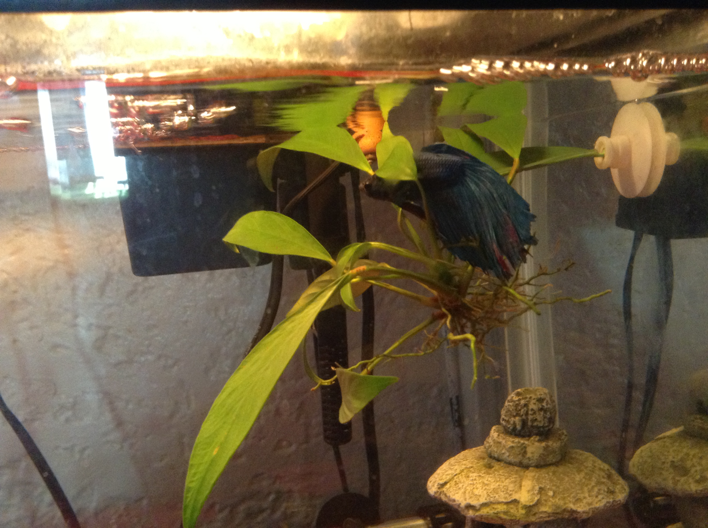

# Manga-Spring.com

This is the backend to [manga-spring](manga-spring.com) built using Java, SpringBoot, RSocket, MongoDB, and Other Technologies.

I consider this to be the coolest API I've built so far, with the power of Reactive Streams, Rsocket, GraalVM Native Images, it's got the whole package.

# Diagrams

## Setup 
This happens before you can connect to any routes, auth creds are provided, then the RSocket connection is established. Client-ID and Rsocket is saved in memory as long as client is connected.

After Connection is setup, server will then request an activity stream for logging and certain operations.

## Request Stream
Here we have the basic streaming route, where you request a stream of data from mongo. First you have the basic making a query on mongo, and get the results as a stream.

The other scenraio requests a stream from the mongo change streams, which will monitor the db and stream any changes in the collection to the requester.

## Request Channel

Rsocket has Bi-Directional communication. I have an update batch project that'll update the db every now and then it'll connect to the server and send the records to update and recieve reponses as each is replaced in the collection. After the batch is finished, a Fire-And-Forget request will go out to all connected clients.

# Fish

